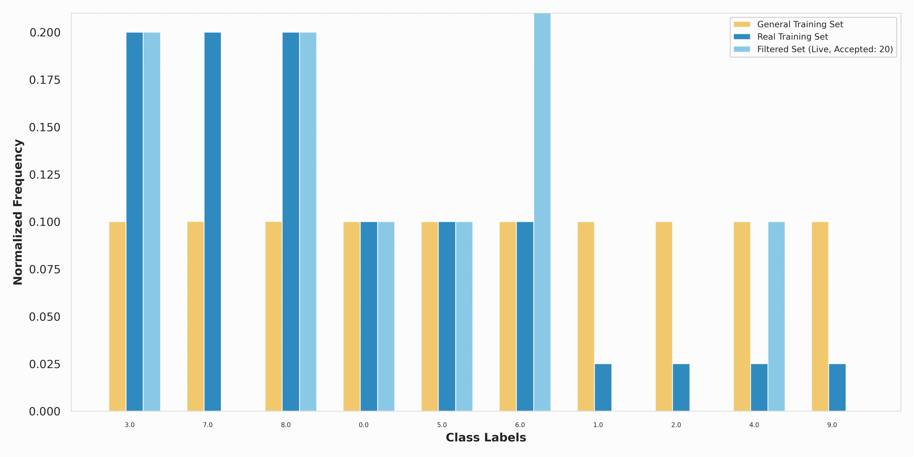

# Beyond Deep Fake Detection (2025)

This repository contains the official implementation of our paper:

> **Beyond Deep Fake Detection: Framework for Semantic Calibration of deceptive media distributions.**

## 🔗 Links

- 📝 Paper: [2025 PDF Link] <!-- update once available -->
- 🤗 Hugging Face: [https://huggingface.co/BeyondDeepFakeDetection](https://huggingface.co/BeyondDeepFakeDetection)
- 📊 Datasets: [https://huggingface.co/BeyondDeepFakeDetection](https://huggingface.co/BeyondDeepFakeDetection)
- 📦 Fine-tuned Models: [https://huggingface.co/BeyondDeepFakeDetection](https://huggingface.co/BeyondDeepFakeDetection)
- 📁 Code: [https://github.com/BeyondDeepFakeDetection/Beyond-Deep-Fake-Detection](https://github.com/BeyondDeepFakeDetection/Beyond-Deep-Fake-Detection)

---

## 🧠 Overview

**Beyond Deepfake Detection** addresses a key limitation in current deepfake detection systems: the overreliance on low-level visual artifacts that may disappear as generative models improve. Instead of merely asking *"Is this media fake?"*, our work shifts the focus to a more meaningful question: **"Is the semantic content deceptive?"**

We formally define the notion of **deception** in online media and introduce **semantic calibration** — a framework that detects media samples which distort semantic expectations, even when they are synthetically flawless. Our pipeline operates by:

- Captioning media content into text using image-to-text and audio-to-text models
- Computing acceptance probabilities for semantic consistency using fine-tuned large language models (LLMs)
- Rejection sampling over the semantic space to detect content that is surprising or overrepresented under a calibrated distribution

This approach is:

- **Modality-agnostic**: applicable to any media that can be converted to text  
- **Explainable**: decisions are based on interpretable semantic tokens  
- **Robust to future generative advances**: does not rely on generative artifacts

We release:
- Code to reproduce all experiments from the paper.
- Pretrained GPT-2 models fine-tuned on general and real distributions.
- Semantically distorted datasets simulating distribution shifts.
- Evaluation script for kl-divergence and deception reduction metrics.
---

## Visualisation of our filtering mechanism
<p align="center">
  
</p>

## 📦 Installation

We recommend using a virtual environment:

```bash
git clone https://github.com/BeyondDeepFakeDetection/.git
cd Beyond-Deep-Fake-Detection
python -m venv venv
source venv/bin/activate
pip install -r requirements.txt
```

## ✅ Quick Start
We will navigate through an example of running the full pipeline and reproducing results from the paper.

### Computing log-probs of texts

1. **Install dependencies:**
   ```bash
   pip install transformers torch pandas huggingface_hub safetensors tqdm datasets seaborn matplotlib numpy 
   ```

2. **Set the following variables in `token_sequence_probs.py`:**
   - `hf_token`: Your HuggingFace API token.
   - `model_name`: The name of the model to use (e.g., `"CIFAR-10_general, cifar-10_moderate"`).
   - `save_name`: Path (without `.csv`) where token-prob results will be saved.
   - `dataset`: The HuggingFace dataset name (e.g., `"CIFAR-10"`).
   - `text_column`: The column in the dataset containing the text (default: `"text"`).
This script computes log probabilities for each word in a dataset of texts using a HuggingFace language model, and saves the results to a CSV file.

3. **Run the script twice, once for the general and one for the real model with the split of choice (baseline|mild|moderate|severe):**
   ```bash
   python token_sequence_probs.py
   ```
   
#### Output token_sequence_probs.py

The script saves a CSV file at `<save_name>.csv` with columns:
- `text_id`: Index of the text in the dataset.
- `total_log_prob`: Sum of log probabilities for the text.
- `avg_log_prob`: Average log probability per word.
- `word_probabilities`: List of (word, log_prob) pairs.
Now having two such CSV files we can compare probability ratios between the two models.

### Running the rejection sampling and evaluating performance

4. **Set the following variables in semantic_calibration_evaluation.py**
   - "label_column_name": The column in teh dataset containing the label (fine_label, coarse_label, label, etc.)
   - "text_column_name" : The column in the dataset containing the text (default: `"text"`).
   - "split_name": choice of split name (baseline/mild/moderate/severe)
   - "dataset_name": The HuggingFace dataset name (e.g., `"CIFAR-10"`)
   - "save_path" : Set the name o the output path for the Label Distribution Comparison plot.
   - "real_probs_csv" = Enter the output path of the real-model probabilities (computed in step 3)
   - "general_probs_csv" = Enter the output path of the general-model probabilities (computed in step 3)

5. Run the script:
   ```bash
   python semantic_calibration_evaluation.py
   ```
   
### Output semantic_calibration_evaluation.py
Printed you will find the results of the experiment, namely the KL-divergence between the general and real distribution, and the filtered and real distribution. The goal is to minimize the latter. A matplotlib chart of the normalized frequencies of the labels will also be plotted. 

